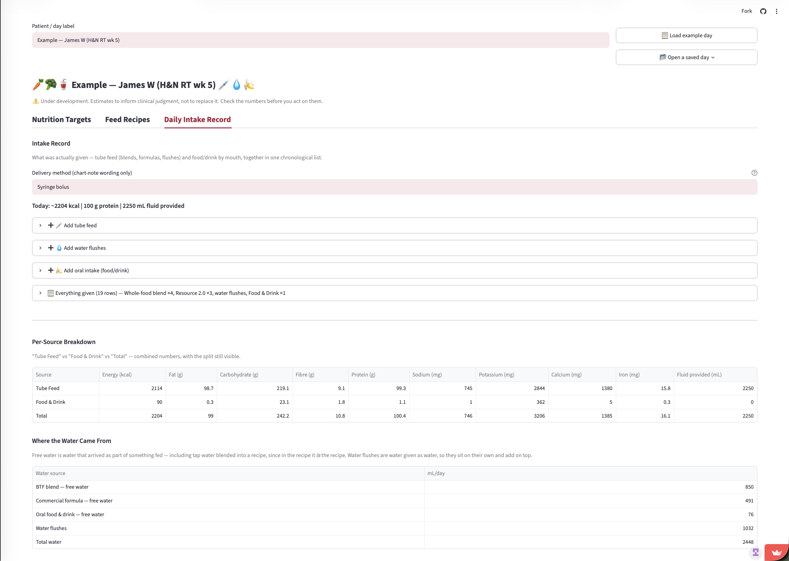
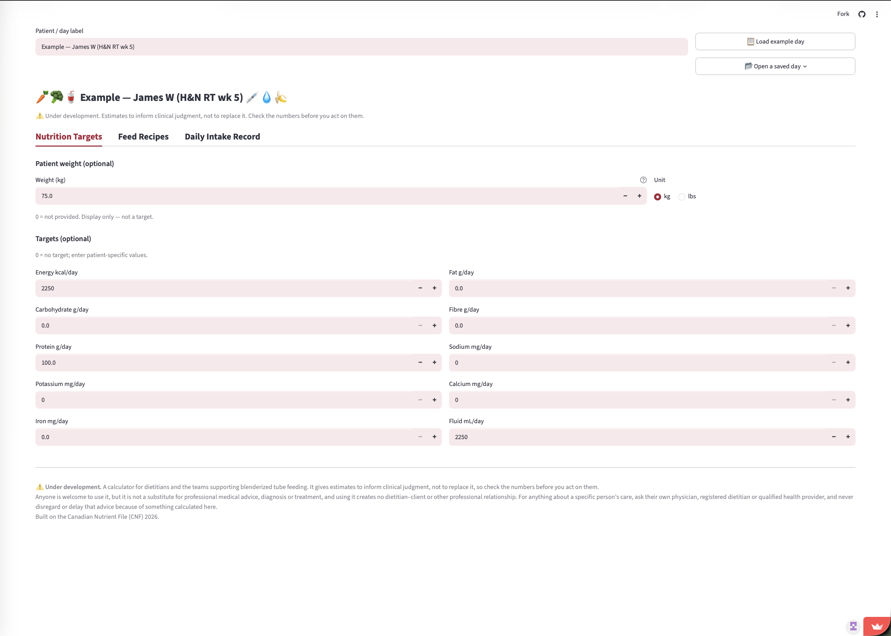

# Blenderized Tube Feed Calculator

Work out the calories, protein, fluid and micronutrients in a home-blended
tube feed, and see what happens when you change it.

Built for registered dietitians, on the **Canadian Nutrient File (CNF)
2026**. It gives estimates; the clinical judgment stays with the
dietitian using it.

### ▶ Try it: **https://btfcalc.streamlit.app**

**[Watch the 3-minute demo](https://vimeo.com/1216832087)**, which follows
the tool from targets through to the chart note.

There is nothing to install and no account to create. Click **"Load example
record"** in the top row to see a worked case with a nine-ingredient blend, a
commercial formula, water flushes and one oral food.



---

## What it does

- **Characterizes a blend you already use.** Enter what goes in the
  blender and the volume you measured coming out. You get kcal/mL,
  protein g/mL and free-water fraction. Volume is measured, never
  computed, because blending, air and rinse water make it impossible to
  calculate from ingredient weights.
- **Records a whole day.** Blends, commercial formulas, water flushes and
  food by mouth in one chronological list. Daily totals are a direct sum
  of what was actually given.
- **Compares against commercial formulas.** 33 adult Canadian tube-feeding
  formulas, filterable by manufacturer, at a daily volume you choose.
- **Searches 5,993 CNF foods** by all your words in any order, with typo
  tolerance. It never chooses a food for you.
- **Reads a nutrition label from a photo** into a form you check against
  the label in your hand. A nutrient that isn't printed comes back blank,
  never as zero.
- **Saves your day to a spreadsheet** you can reopen later or edit in
  Excel, and exports a chart note you can paste into your own records.




## Scope and safety

- **Canada only, for now.** Nutrient tracking follows the Canadian
  Nutrition Facts panel and reference data lives in
  `data/packs/canada/`. Another country would be a new pack of CSVs, not
  a code change.
- **No default targets anywhere.** Targets start blank and you enter
  patient-specific values, or leave them blank and read the totals. A
  population default is not defensible for tube-fed patients.
- **A zero can mean "never measured", not "none present".** The report's
  *Coverage* column shows how many of your sources actually supplied a
  value for each nutrient, and rows where nothing did are hidden rather
  than shown as a confident 0.
- **No patient data is stored.** The app keeps nothing server-side. Saved
  days download to your own machine, and they contain whatever you typed
  in the record label.
- **Estimates only.** This tool cannot measure viscosity, tube flow or
  tolerance, and it does not compute targets or assess anyone.
- **It is a calculator, not a clinician.** It does not recommend a feeding
  plan or decide anything about a patient. The dietitian using it makes
  those decisions and remains responsible for them.
- **Using it creates no professional relationship.** See the
  [medical disclaimer](#medical-disclaimer) below.

---

## Run it on your own machine

You need **Python 3.14 or newer**. Older versions will not run it.

```bash
git clone https://github.com/greywhitebinary/blenderized-tubefeed-calculator.git
cd blenderized-tubefeed-calculator
python3 -m venv .venv
.venv/bin/pip install -r requirements.txt
.venv/bin/streamlit run app/streamlit_app.py
```

It opens at http://localhost:8501. The CNF data ships with the repo, so
there is nothing else to download.

**Optional:** the label-photo feature calls the Anthropic API. Without a
key the photo control does not appear, and labels are typed in by hand
exactly as before the feature existed. To enable it, put your own
key in `.streamlit/secrets.toml`:

```toml
ANTHROPIC_API_KEY = "your-key-here"
```

You are billed for your own usage. Caps live in `src/label_extract.py`.

## Check that you can trust the numbers

The math has four steps: load CNF data, scale by grams, divide by
measured volume, multiply by daily volume. You can check every one with a
calculator and a browser, without reading any code.

**Scaling.** Run `python scripts/trace_calculation.py`. It prints every
intermediate table for a worked recipe. Find the `[4] SCALE` table and
check any row:

> 200 g chicken × (120 kcal per 100 g ÷ 100) = **240 kcal**

**Source data.** Look the same food up on [Health Canada's own CNF
search](https://food-nutrition.canada.ca/cnf-fce/?lang=eng) and compare
its per-100 g values against the trace. Matching numbers mean the app is
reading the database faithfully.

**Density.** In the app, total kcal ÷ measured volume should equal the
kcal/mL on screen. For example, 557 kcal ÷ 550 mL = 1.013 kcal/mL.

Every equation is written out in `BUSINESS_CASE.md`, Appendix A.

## Editing the reference data

All of it is CSV under `data/packs/canada/`. Edit in Excel or any text
editor, save, and rerun the app. No Python required.

| What | File |
|---|---|
| Which nutrients are tracked, and why | `nutrients.csv` |
| Commercial formula profiles | `formulas.csv` |
| Thinning liquid presets | `thinning_liquids.csv` |
| Lay-term search synonyms | `food_synonyms.csv` |

`nutrients.csv` drives the calculator, both report tables, the targets
form and the label-photo schema. Adding a row there adds the nutrient
everywhere. See `MAINTAINING.md` for the column meanings and the workflow
for updating formulas from manufacturer PDFs.

## How it's built

Streamlit and pandas, with the math in plain Python under `src/`.

- 236 unit tests, plus 9 verification checks, eight of which drive the
  real UI through Streamlit's `AppTest`
- GitHub Actions runs all of it on every push and fails the build on lint
- `src/` is Streamlit-free, so the calculations are testable without a
  browser

```
app/                   the UI: the page, the add-a-food component, styles
src/                   calculator, data loading, nutrient registry, file I/O
data/packs/canada/     editable reference data
scripts/               verification checks
tests/                 unit tests
```

## Further reading

| Document | What's in it |
|---|---|
| `BUSINESS_CASE.md` | The clinical problem, and every equation (Appendix A) |
| `CONTEXT.md` | Full design history and the reasoning behind each decision |
| `MAINTAINING.md` | Day-to-day workflows for running and updating the project |

## Get in touch

I'd like to hear from you if you manage blenderized tube feeds and have
thoughts on this, if you've found a wrong number or a bug, or if you want
to adapt it for another country's data.

- **Bugs, wrong numbers, ideas:** open a
  [GitHub issue](https://github.com/greywhitebinary/blenderized-tubefeed-calculator/issues).
  Public, so the next person with the same question finds the answer.
- **To find me:** [LinkedIn](https://www.linkedin.com/in/hui-jun-gail-chew/)
- **To read more:** [Feed. Form. Flow.](https://feedformflow.substack.com)

**I can't advise on a specific person's care.** I'm a registered
dietitian, but not your dietitian. See the
[medical disclaimer](#medical-disclaimer) below.

## Who this is for

Built for dietitians and the other healthcare professionals who support
blenderized tube feeding.

If you're a patient, a parent or a caregiver doing this at home, you're
welcome to use it. The numbers are the same. What differs is what
happens next: bring what you find to your own healthcare team, who can
weigh it against everything else they know about the person in front of
them.

## Medical disclaimer

This is a calculator for dietitians and the teams supporting blenderized
tube feeding. It gives estimates to inform clinical judgment, not to
replace it, so check the numbers before you act on them.

Anyone is welcome to use it, but it is not a substitute for professional
medical advice, diagnosis or treatment, and using it creates no
dietitian–client or other professional relationship. For anything about a
specific person's care, ask their own physician, registered dietitian or
qualified health provider, and never disregard or delay that advice
because of something calculated here.

The author is a registered dietitian, but is not your dietitian and cannot
advise on any individual's care.

## Licence

[MIT](LICENSE). Use it, fork it, adapt it for another country's data.

The licence includes the standard warranty disclaimer, which matters here:
the software is provided as is, and clinical responsibility stays with the
dietitian using it.

---

*Built with AI assistance. The reasoning behind each decision is recorded
in `CONTEXT.md` and in the commit history.*
