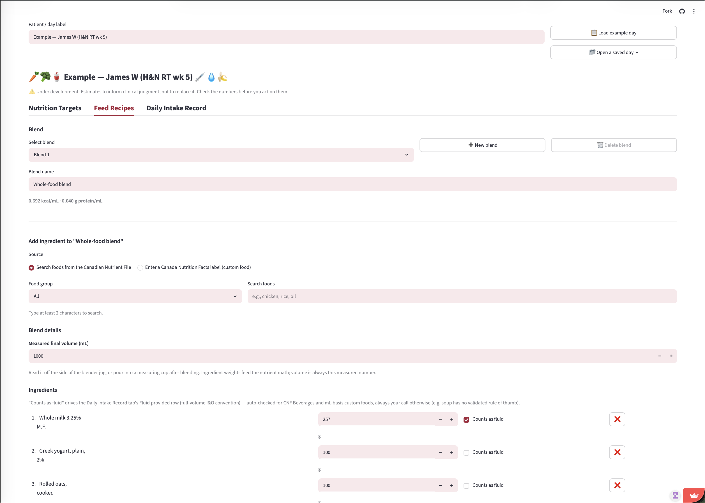

# Blenderized Tube Feed Calculator

Work out the calories, protein, fluid and micronutrients in a home-blended
tube feed, and see what happens when you change it.

Built for registered dietitians, on the **Canadian Nutrient File (CNF)
2026**. Estimates only — RD clinical judgment is the final authority.

### ▶ Try it: **https://btfcalc.streamlit.app**

No install, no account, nothing to set up. Click **"Load example day"** in
the top row to see a worked case with a nine-ingredient blend, a
commercial formula, water flushes and one oral food.



---

## What it does

- **Characterizes a blend you already use.** Enter what goes in the
  blender and the volume you measured coming out. You get kcal/mL,
  protein g/mL and free-water fraction. Volume is measured, never
  computed, because blending, air and rinse water make it impossible to
  calculate from ingredient weights.
- **Records a whole day.** Blends, commercial formulas, water flushes and
  food by mouth in one chronological list. Daily totals are a direct sum
  of what was actually given.
- **Compares against commercial formulas.** 33 adult Canadian tube-feeding
  formulas, filterable by manufacturer, at a daily volume you choose.
- **Searches 5,993 CNF foods** by all your words in any order, with typo
  tolerance. It never auto-picks a food for you.
- **Reads a nutrition label from a photo** into a form you check against
  the label in your hand. A nutrient that isn't printed comes back blank,
  never as zero.
- **Saves your day to a spreadsheet** you can reopen later or edit in
  Excel, and exports a chart note you can paste into your own records.

## Scope and safety

- **Canada only, for now.** Nutrient tracking follows the Canadian
  Nutrition Facts panel and reference data lives in
  `data/packs/canada/`. Another country would be a new pack of CSVs, not
  a code change.
- **No default targets anywhere.** Targets start blank and you enter
  patient-specific values, or leave them blank and read the totals. A
  population default is not defensible for tube-fed patients.
- **A zero can mean "never measured," not "none present."** The report's
  *Coverage* column shows how many of your sources actually supplied a
  value for each nutrient, and rows where nothing did are hidden rather
  than shown as a confident 0.
- **No patient data is stored.** The app keeps nothing server-side. Saved
  days download to your own machine, and they contain whatever you typed
  in the day label.
- **For RD use, estimates only.** This tool cannot measure viscosity, tube
  flow or tolerance, and it does not compute targets or assess anyone.

---

## Run it on your own machine

You need **Python 3.14 or newer**. Older versions will not run it.

```bash
git clone https://github.com/greywhitebinary/blenderized-tubefeed-calculator.git
cd blenderized-tubefeed-calculator
python3 -m venv .venv
.venv/bin/pip install -r requirements.txt
.venv/bin/streamlit run app/streamlit_app.py
```

It opens at http://localhost:8501. The CNF data ships with the repo, so
there is nothing else to download.

**Optional:** the label-photo feature calls the Anthropic API. Without a
key the photo control simply doesn't appear and you type labels in by
hand, exactly as before the feature existed. To enable it, put your own
key in `.streamlit/secrets.toml`:

```toml
ANTHROPIC_API_KEY = "your-key-here"
```

You are billed for your own usage. Caps live in `src/label_extract.py`.

## Check that you can trust the numbers

The maths has four hops: load CNF data, scale by grams, divide by
measured volume, multiply by daily volume. You can check every one with a
calculator and a browser, without reading any code.

**Scaling.** Run `python scripts/trace_calculation.py`. It prints every
intermediate table for a worked recipe. Find the `[4] SCALE` table and
check any row:

> 200 g chicken × (120 kcal per 100 g ÷ 100) = **240 kcal**

**Source data.** Look the same food up on [Health Canada's own CNF
search](https://food-nutrition.canada.ca/cnf-fce/?lang=eng) and compare
its per-100 g values against the trace. Matching numbers mean the app is
reading the database faithfully.

**Density.** In the app, total kcal ÷ measured volume should equal the
kcal/mL on screen. For example, 557 kcal ÷ 550 mL = 1.013 kcal/mL.

Every equation is written out in `BUSINESS_CASE.md`, Appendix A.

## Editing the reference data

All of it is CSV under `data/packs/canada/`. Edit in Excel or any text
editor, save, and rerun the app. No Python required.

| What | File |
|---|---|
| Which nutrients are tracked, and why | `nutrients.csv` |
| Commercial formula profiles | `formulas.csv` |
| Thinning liquid presets | `thinning_liquids.csv` |
| Lay-term search synonyms | `food_synonyms.csv` |

`nutrients.csv` drives the calculator, both report tables, the targets
form and the label-photo schema. Adding a row there adds the nutrient
everywhere. See `MAINTAINING.md` for the column meanings and the workflow
for updating formulas from manufacturer PDFs.

## How it's built

Streamlit and pandas, with the maths in plain Python under `src/`.

- 154 unit tests, plus 9 verification checks, six of which drive the real
  UI through Streamlit's `AppTest`
- GitHub Actions runs all of it on every push and fails the build on lint
- `src/` is Streamlit-free, so the calculations are testable without a
  browser

```
app/streamlit_app.py   the UI
src/                   calculator, data loading, nutrient registry, file I/O
data/packs/canada/     editable reference data
scripts/               verification checks
tests/                 unit tests
```

## Further reading

| Document | What's in it |
|---|---|
| `BUSINESS_CASE.md` | The clinical problem, and every equation (Appendix A) |
| `CONTEXT.md` | Full design history and the reasoning behind each decision |
| `MAINTAINING.md` | Day-to-day workflows for running and updating the project |

## Licence

[MIT](LICENSE). Use it, fork it, adapt it for another country's data.

The licence includes the standard warranty disclaimer, which matters here:
the software is provided as is, and clinical responsibility stays with the
dietitian using it.

---

*Built with AI assistance. The reasoning behind each decision is recorded
in `CONTEXT.md` and in the commit history.*
